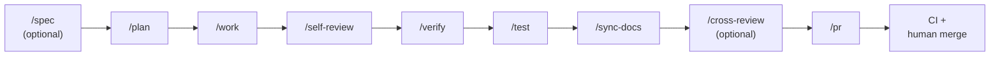

<div align="center">

# ralph

**Claude Code + Codex harness engineering.**

Scaffold, upgrade, and run opinionated agent harnesses that work with both Claude Code and OpenAI Codex from the same project — small always-on maps, on-demand skills, deterministic hooks, evidence-backed reviews, and an optional autonomous multi-seat execution surface (org runtime).

[](https://github.com/yoshpy-dev/ralph/actions/workflows/verify.yml)
[](https://github.com/yoshpy-dev/ralph/releases/latest)
[](go.mod)
[](LICENSE)
[](#install)
[](https://github.com/yoshpy-dev/ralph/releases)

[Why ralph?](#why-ralph) &middot; [Install](#install) &middot; [Quick start](#quick-start) &middot; [Features](#features) &middot; [Commands](#commands) &middot; [Operating loop](#operating-loop) &middot; [Org runtime](#org-runtime-autonomous-multi-seat-execution) &middot; [Language packs](#language-packs) &middot; [Portability](#portability)

</div>

## Why ralph?

Claude Code gives you a powerful agent, but the default setup is a blank slate. Repo-level harness conventions — rules, skills, hooks, subagents, verification scripts — have to be invented, maintained, and upgraded by hand, and they drift fast across projects.

`ralph` ships those conventions as a distributable, upgradable scaffold.

| | Bare Claude Code | `ralph init` |
|---|:---:|:---:|
| Always-on map (`AGENTS.md` / `CLAUDE.md`) | — | ✓ |
| On-demand skills (spec, plan, work, verify, ...) | manual | 10+ bundled |
| Deterministic hooks (mojibake guard, commit-msg, bash guard, ...) | manual | pre-wired |
| Evidence-backed pipeline (self-review → verify → test → sync-docs → cross-review) | ad hoc | canonical order, enforced |
| Isolated task execution | ad hoc branches | clean-base task worktrees |
| Autonomous multi-seat execution | — | org runtime (`ralph org`) |
| Language packs (TS, Python, Rust, Go, Dart, Terraform) | — | opt-in |
| Drift management between projects | manual copy | `ralph upgrade` |
| Cross-agent portability | — | portable `AGENTS.md` + scripts |

## Install

```sh
# Homebrew
brew install yoshpy-dev/tap/ralph

# Or install script (verifies SHA256 against GitHub Releases)
curl -fsSL https://raw.githubusercontent.com/yoshpy-dev/ralph/main/scripts/install.sh | sh
```

Verify:

```sh
ralph version
ralph doctor
```

## Quick start

```sh
ralph init my-project
cd my-project
ralph doctor                  # environment check (Claude + Codex)
```

Both agent surfaces are wired up automatically. To make Codex's project-level config and
hooks actually load, run `codex trust .` once after `ralph init`. `ralph doctor`
flags trust gaps so you do not lose hooks silently.

Create your first plan and run the loop inside Claude Code. Prefer the skills
because they create clean-base task worktrees before writing plan artifacts:

```
/plan
```

The lower-level `./scripts/new-feature-plan.sh` helper remains available
inside an already resolved task worktree.

In Claude Code, follow the loop with slash commands:

```
/spec (optional) → /plan → /work
→ /self-review → /verify → /test → /sync-docs
→ /cross-review (optional) → /pr
```

In Codex, the same flow runs via skill mention syntax (`/spec` collides with
Codex built-in slash commands — use `$skill-name` or the `/skills` menu):

```
$spec (optional) → $plan → $work
→ $self-review → $verify → $test → $sync-docs
→ $cross-review (optional) → $pr
```

For autonomous multi-seat execution outside this interactive loop, see
[Org runtime](#org-runtime-autonomous-multi-seat-execution).

Before claiming a task is done:

```sh
./scripts/run-verify.sh
```

## Features

| | |
|:---|:---|
| **Maps, not manuals**<br/>Short `AGENTS.md` / `CLAUDE.md`; push detail into rules and skills, promote repeats into hooks. | **Canonical pipeline**<br/>`self-review → verify → test → sync-docs → cross-review → pr` enforced in the standard flow. |
| **Deterministic hooks**<br/>Mojibake guard, commit-msg secret scan, Bash guardrails, verification reminders — pre-wired in `settings.json`. | **Worktree-first flow**<br/>Spec, plan, work, and PR artifacts are produced from clean-base task worktrees, with local cleanup after hand-off. |
| **Org runtime**<br/>Autonomous multi-seat execution (`ralph org spawn/send/wait/...`) with a typed messaging protocol and pulse-layer watchdog — see [Org runtime](#org-runtime-autonomous-multi-seat-execution). | **Language packs**<br/>TypeScript, Python, Rust, Go, Dart, and Terraform starters (opt-in) with per-language `verify.sh` and path-scoped rules. |
| **Drift-proof upgrades**<br/>Hash-based `ralph upgrade` with per-file conflict resolution — keeps N projects aligned as the scaffold evolves. | **Evidence over prose**<br/>Every self-review, verify, test, sync-docs, and cross-review triage pass produces a dated artifact in `docs/reports/`. |
| **Cross-agent portable**<br/>`AGENTS.md` + `scripts/` + `packs/` stay neutral; `.claude/` and `.codex/` are agent-specific layers you can stack others beside. | **Local state, not repo churn**<br/>Worktree lifecycle records live under `git-common-dir`, outside tracked files and branch checkouts. |

## Commands

| Command | Purpose |
|---------|---------|
| `ralph init [name]` | Scaffold a new project (interactive: language packs). |
| `ralph upgrade` | Pull template updates with per-file conflict resolution. |
| `ralph org spawn/send/wait/read/stop/status/disband` | Manage org-runtime seats for autonomous multi-seat execution. |
| `ralph status [--org-id <id>]` | Show org roster status and watch-status summary (table or `--json`). |
| `ralph pack add <lang>` | Install a language pack. |
| `ralph doctor` | Check Claude Code, Codex, hooks, manifest drift, language packs. |
| `ralph insights [--json]` | Aggregate pipeline insight events into a routing/pipeline summary. |
| `ralph insights backfill [--apply]` | Derive events from existing Markdown reports (dry-run by default). |
| `ralph version` | Show semver + commit + build date. |

Run `ralph help <command>` for flags.

### `ralph upgrade` interactive diff

When `ralph upgrade` detects local edits and a template baseline is available, it shows a line-numbered local-vs-template diff and prompts `[a]pply template file / [k]eep local file / [e]dit file ?`. `apply` accepts the template for the whole file; `keep` preserves the current local file as the resolved managed content; `edit` opens the whole file with Git-style conflict marker blocks (`<<<<<<< local`, `=======`, `>>>>>>> template (...)`) around conflicting regions and requires the markers to be removed before the edit is accepted.

Before file choices are written, `ralph upgrade` prints an apply summary and asks `Apply these changes? [y/N]`. Answering no or reaching EOF writes nothing to the target file, baseline cache, or manifest. Normal interactive diff output is rendered inline with the prompt, omits range headers and template/local hash summaries, and does not open a pager. When baseline metadata is missing, v1-style projects fall back to `[o]verwrite / [s]kip / [d]iff ?` with the diff shown before the choices.

Diff lines carry a right-aligned `<old> <new> │ <prefix><content>` gutter, and `-` / `+` are colorized (red / green; `---` / `+++` bold) when stdout is a terminal. Set `NO_COLOR=1` (or any non-empty value, per [no-color.org](https://no-color.org)) to suppress ANSI escapes; piping or redirecting also disables them automatically. `--pager` applies to `ralph upgrade --diff` dry-run previews, not to interactive conflict prompts.

## What `ralph init` scaffolds

The philosophy: **a map, not a manual**. Keep `AGENTS.md` small, push detail into rules and skills, promote repeated mistakes into hooks, scripts, tests, or CI.

<details>
<summary>Scaffold tree</summary>

```text
.
├── AGENTS.md                 # vendor-neutral map; user-owned skeleton + a managed block (source: .ralph/core/AGENTS.core.md)
├── CLAUDE.md                 # minimal seed (imports AGENTS.md); ralph guidance auto-loads from .claude/rules/ralph/
├── .claude/
│   ├── settings.json         # each event points at ./.claude/hooks/ralph-dispatch.sh <event>
│   ├── hooks/                # hook implementations + <event>.d/ dispatch entries (core -> .ralph/local -> .claude/hooks/local)
│   ├── skills/               # on-demand workflows (plan, work, verify, ...)
│   ├── agents/               # Claude Code subagent definitions
│   └── rules/ralph/          # shipped ralph guidance (path-scoped, read by both agents); language pack rules render here too
├── .codex/
│   ├── config.toml           # model, sandbox, approval, hooks (loads after `codex trust .`)
│   ├── agents/               # Codex role definitions for review/verify/test/docs
│   ├── hooks/                # Codex hook scripts
│   ├── AGENTS.override.md    # Codex-only execution rules
│   └── README.md             # Codex setup and operator guide
├── .agents/
│   └── skills/               # Codex-side skill bodies (mirrors .claude/skills/)
├── .ralph/
│   ├── core/                 # generation sources ralph init/upgrade consume (e.g. AGENTS.core.md)
│   └── local/                # downstream extension points: hooks/<event>.d/, verify.d/, test.d/
├── docs/
│   ├── specs/                # refined specifications from /spec
│   ├── plans/active/         # plans in flight
│   ├── plans/archive/        # completed plans
│   ├── reports/              # self-review, verify, test artifacts
│   ├── quality/              # definition of done, quality gates
│   └── tech-debt/            # tracked debt
├── packs/languages/          # opt-in language specializations
├── scripts/                  # branch-name.sh, ensure-pr-ready.sh, ensure-pr-title-prefix.sh, run-verify.sh, etc.
├── ralph.toml                # CLI config
└── .github/workflows/        # CI
```

</details>

## Operating loop



Every step in the loop, including `/spec`, is auto-invoked. `/release` is the only manual-trigger skill and lives outside the loop (repo maintainer use).

1. **Spec** (auto, optional — `/spec`) — refine vague requests through decision-tree questioning with recommended answers, codebase exploration, and interactive clarification. Issue-only specs use a temporary clean-base worktree and cleanup; saved specs create a docs/spec PR or hand off to `/plan`.
2. **Plan** (auto — `/plan`) — ensures a clean-base task worktree, then writes a file-backed plan in `docs/plans/active/` with acceptance criteria, verify plan, test plan, risks.
3. **Work** (auto — `/work`) — resumes the task worktree and implements interactively, delegating slices to the `implementer` subagent.
4. **Self-review** (auto — `/self-review`) — diff quality artifact.
5. **Verify** (auto — `/verify`) — spec compliance + static analysis.
6. **Test** (auto — `/test`) — behavioral tests must pass before PR.
7. **Sync docs** (auto — `/sync-docs`) — alignment across AGENTS.md / CLAUDE.md / rules / README.
8. **Cross-review** (auto, optional — `/cross-review`) — cross-model second opinion via the other agent: Claude Code calls Codex; Codex calls `claude -p`. Silently skipped if the reviewer side is unavailable.
9. **PR** (auto — `/pr`) — structured PR, plan archival, hand-off, and task worktree/local branch cleanup.
10. **CI + human merge**.

See `.claude/rules/ralph/post-implementation-pipeline.md` for the canonical pipeline order.

## Org runtime (autonomous multi-seat execution)

For autonomous execution outside the interactive `/work` loop, `ralph org` spawns and coordinates multiple agent seats (a `lead` plus roles like `reviewer`, `qa`) over a typed messaging protocol (star topology — every seat addresses `TO: lead` only), with a two-layer watchdog (pulse watch + on-demand watcher) and an append-only manifest so `ralph status` works even if the underlying driver is stopped.

```sh
ralph org spawn --org-id my-task --id lead --role lead
ralph org send --org-id my-task --to lead --text "TYPE: TASK
TASK_ID: 1

..."
ralph status --org-id my-task
ralph org report --org-id my-task
ralph org disband --org-id my-task
```

See `docs/specs/2026-08-01-org-runtime.md` for the full protocol and `.claude/rules/ralph/agent-messaging.md` for the message-shape contract.

## Hooks

`.claude/settings.json` points each event at a single dispatcher entry, `./.claude/hooks/ralph-dispatch.sh <event>`, which fans out in order through `.claude/hooks/<event>.d/` (core), `.ralph/local/hooks/<event>.d/` (downstream local, committed), then `.claude/hooks/local/<event>.d/` (downstream local, gitignored). The core `.d/` entries ship pre-configured: session start context, prompt-level reminders, Bash guardrails, edit/write verification reminders, tool failure feedback, compaction checkpoints, session end summary. Add your own hook by dropping a script into `.ralph/local/hooks/<event>.d/` — no `settings.json` edits needed (Claude Code today; Codex's `.codex/config.toml` still calls hook scripts directly, so `.ralph/local/hooks/<event>.d/` drop-ins do not run under Codex yet — Phase 3 tech debt). Customize `.claude/settings.json` directly; use `.claude/settings.local.json` for personal overrides (gitignored).

## Language packs

Core scaffold stays stack-agnostic. Language-specific depth lives in `packs/languages/`. Starter packs included: `typescript/`, `python/`, `rust/`, `golang/`, `dart/` (Flutter), `terraform/` (Terraform / OpenTofu), plus a `_template/` for new packs.

Add a pack:

```sh
ralph pack add golang
# or
./scripts/new-language-pack.sh golang
```

Wire it into `packs/languages/<name>/verify.sh`, `.claude/rules/ralph/<name>.md`, and project build/test tooling.

## Portability

`ralph` ships both Claude Code and Codex surfaces always-on, plus a portable
core that any future agent surface can reuse:

- **Portable**: `AGENTS.md`, `scripts/`, `.github/workflows/`, `packs/languages/`, `docs/`
- **Claude-native**: `CLAUDE.md`, `.claude/rules/`, `.claude/skills/`, `.claude/hooks/`, `.claude/agents/`
- **Codex-native**: `.codex/config.toml`, `.codex/agents/`, `.codex/hooks/`, `.codex/AGENTS.override.md`, `.codex/README.md`, `.agents/skills/`

`scripts/check-skill-sync.sh` keeps `.claude/skills/` and `.agents/skills/` in
lock-step on body, name, description, and implicit-invocation policy. CI fails
on drift so the two agent surfaces cannot quietly diverge.

### Known differences between Claude Code and Codex

| Concern | Claude Code | Codex |
|---------|-------------|-------|
| Skill invocation | `/skill-name` slash command | `$skill-name` mention or `/skills` menu — `/skill-name` collides with Codex built-ins (`/plan`, `/review`, `/status`) |
| Subagents in `/work` post-impl | `Task(subagent_type=...)` calls | `.codex/agents/` custom agents with the same phase roles |
| Structured prompts | `AskUserQuestion` | numbered stdin prompt |
| Cross-model reviewer | calls `codex exec review` | calls `claude -p` with adversarial reviewer prompt |
| Org seat permission policy | `ralph.toml` `[org.permissions] default = "autonomous"` (or `"edits"` / `"guarded"`; per-role overrides supported) | same enum, mapped to Codex's own sandbox/approval flags |
| Config trust | always loads `.claude/settings.json` | only loads `.codex/config.toml` after `codex trust .` AND `[features] hooks = true` |

## Adoption order

See `docs/roadmap/harness-maturity-model.md`. Short version:

1. Map + verify
2. Plan/work/self-review/verify skills
3. Deterministic hooks
4. Path-scoped rules and subagents
5. Worktrees and agent teams for genuinely parallel tasks
6. Evaluator loops and richer observability when complexity earns the cost

## Defaults

- Keep `AGENTS.md` short, `CLAUDE.md` shorter
- Topic-specific guidance → `.claude/rules/`
- Workflow-specific guidance → `.claude/skills/`
- Evidence over confidence
- Do not rely on prose for hard guarantees
- Treat human attention as the scarcest resource

## Repository layout (this repo)

<details>
<summary>Source tree</summary>

```text
.
├── cmd/
│   └── ralph/                # CLI entrypoint (cobra + go:embed)
├── internal/
│   ├── cli/                  # Subcommands
│   ├── scaffold/             # Template embedding + manifest
│   ├── upgrade/              # Diff engine + conflict resolution
│   ├── config/                # ralph.toml parser
│   ├── org/                  # Org runtime mechanism layer (seats, protocol, watchdog)
│   └── insights/              # Insight event aggregation + backfill
├── templates/                # go:embed source (distributed by `ralph init`)
│   ├── base/
│   └── packs/
├── packs/languages/
├── scripts/
├── .goreleaser.yml
└── .github/workflows/
```

</details>

## License

MIT
